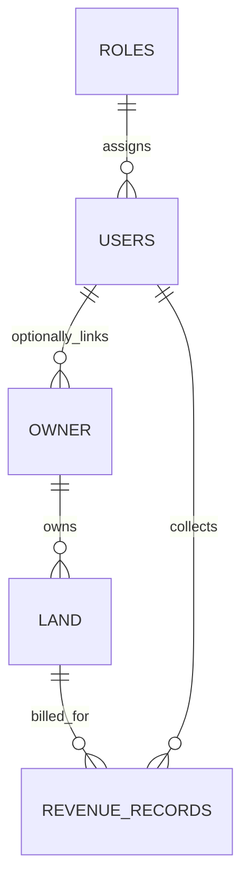

# ER Diagram Explanation: Land Revenue System

This model uses five core entities requested in the prompt: **Users, Roles, Land, Owner, RevenueRecords**.

## 1) Entities and key purpose

- **roles**: reference/master table for authorization roles (Admin, Revenue Officer, Clerk).
- **users**: application accounts and collecting officials.
- **owner**: legal owner profile for land parcels; can optionally be linked to a login user.
- **land**: parcel/plot-level records with location identifiers and area.
- **revenue_records**: annual/periodic assessment and payment records per land parcel.

## 2) Foreign key relationships

- `users.role_id -> roles.role_id`
  - One role can be assigned to many users.
- `owner.user_id -> users.user_id` (optional)
  - Owner profile may be connected to a user account.
- `land.owner_id -> owner.owner_id`
  - One owner can hold many land records.
- `revenue_records.land_id -> land.land_id`
  - One land parcel can have many revenue entries over years.
- `revenue_records.collected_by_user_id -> users.user_id`
  - One user can collect many revenue records.

## 3) Business integrity rules

- Unique `users.username` and `users.email` to prevent duplicate accounts.
- Unique `owner.owner_code` and optional unique `owner.national_id` for identity consistency.
- Unique `land.land_reference_no` for parcel identity.
- Unique `revenue_records(land_id, fiscal_year)` so the same land cannot have duplicate annual records.
- Domain checks on amounts and record status in `revenue_records`.

## 4) ER diagram (Mermaid)

## 5) Index strategy

- FK indexes: `users(role_id)`, `owner(user_id)`, `land(owner_id)`, `revenue_records(land_id)`, `revenue_records(collected_by_user_id)`.
- Search/report indexes:
  - `land(district, village, survey_number)` for parcel lookup by location.
  - `revenue_records(status, due_date)` for overdue/dunning views.
  - `revenue_records(fiscal_year)` for annual reporting.
